# SITE-SITE-IKEv2-ROUTE-BASED

> **Autor:** Randy Nin **| Laboratorio de Redes | GNS3**

Implementación completa de una VPN Site-to-Site Route-Based con IPSec IKEv2 sobre Cisco IOS. Combina la negociación eficiente de IKEv2 (4 mensajes) con una Virtual Tunnel Interface que soporta OSPF de forma nativa, eliminando la necesidad de GRE. Esta es la configuración más moderna y recomendada para VPN Site-to-Site punto a punto en Cisco IOS.

---

## Contenido del repositorio

```
SITE-SITE-IKEv2-ROUTE-BASED/
├── IMG/
│   ├── topology.png
│   ├── before-vpn-ping.png
│   ├── after-vpn-ping.png
│   ├── wireshark-ikev2.png
│   ├── wireshark-esp.png
│   ├── wireshark-esp-detail.png
│   ├── sitea-interface-brief.png
│   ├── siteb-interface-brief.png
│   ├── sitea-ikev2-sa.png
│   ├── siteb-ikev2-sa.png
│   ├── sitea-ipsec-sa.png
│   ├── siteb-ipsec-sa.png
│   ├── sitea-ospf-neighbor.png
│   └── siteb-ospf-neighbor.png
├── Route-Based
├── Documentación Tecnica Profesional VPN Site-to-Site - IPSec IKEv2 - Route-Based (Randy Nin -- 2025-0660).pdf
└── README.md
```

---

## Documentación técnica

La documentación técnica completa está disponible en:

**[Documentación Tecnica Profesional VPN Site-to-Site - IPSec IKEv2 - Route-Based (Randy Nin -- 2025-0660).pdf](Documentación%20Tecnica%20Profesional%20VPN%20Site-to-Site%20-%20IPSec%20IKEv2%20-%20Route-Based%20(Randy%20Nin%20--%202025-0660).pdf)**

---

## Topología

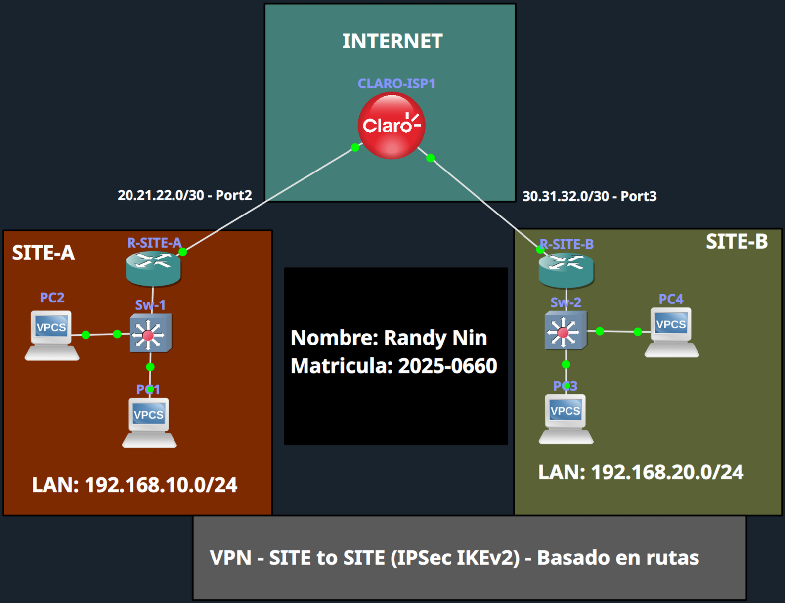

|Dispositivo|Interfaz|IP|Rol|
|:--|:--|:--|:--|
|R-SITE-A|Gi0/0|192.168.10.1/24|Gateway LAN SITE-A|
|R-SITE-A|Gi0/1|20.21.22.1/30|WAN / tunnel source|
|R-SITE-A|Tunnel0|172.16.0.1/30|VTI endpoint|
|R-SITE-B|Gi0/0|192.168.20.1/24|Gateway LAN SITE-B|
|R-SITE-B|Gi0/2|30.31.32.1/30|WAN / tunnel source|
|R-SITE-B|Tunnel0|172.16.0.2/30|VTI endpoint|

---

## Por qué esta es la configuración recomendada

|Ventaja|Detalle|
|:--|:--|
|IKEv2: 4 mensajes|Frente a 9 de IKEv1, con NAT-T y DPD nativos|
|Config modular|Proposal + Policy + Keyring + Profile reutilizables|
|VTI: multicast nativo|OSPF sin GRE, sin overhead extra|
|Sin ACLs de tráfico|La tabla de rutas decide qué se cifra|
|OSPF automático|Rutas propagadas dinámicamente|

---

## Interfaces verificadas

**R-SITE-A:**

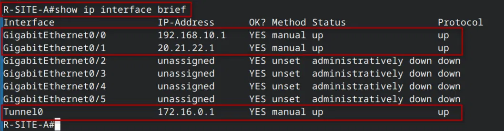

**R-SITE-B:**

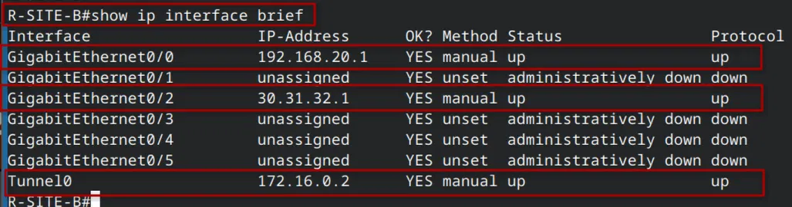

---

## Configuración VPN

El archivo de configuración completo está disponible en [`Route-Based`](https://claude.ai/chat/Route-Based). Bloques clave:

**IKEv2 (proposal + policy + keyring + profile):**

```
crypto ikev2 proposal IKEv2_PROP
 encryption aes-cbc-256
 integrity sha256
 group 14

crypto ikev2 policy IKEv2_POL
 proposal IKEv2_PROP

crypto ikev2 keyring IKEv2_KEYRING
 peer SITE-B
  address 30.31.32.1
  pre-shared-key randy123

crypto ikev2 profile IKEv2_PROF
 match identity remote address 30.31.32.1
 authentication remote pre-share
 authentication local pre-share
 keyring local IKEv2_KEYRING
 lifetime 86400
```

**IPSec profile + VTI + OSPF:**

```
crypto ipsec transform-set TRANF_SET esp-aes 256 esp-sha256-hmac
 mode tunnel

crypto ipsec profile IKEv2_VTI_PROF
 set transform-set TRANF_SET
 set ikev2-profile IKEv2_PROF
 set pfs group14

interface Tunnel0
 ip address 172.16.0.1 255.255.255.252
 tunnel source GigabitEthernet0/1
 tunnel destination 30.31.32.1
 tunnel mode ipsec ipv4
 tunnel protection ipsec profile IKEv2_VTI_PROF

router ospf 10
 network 192.168.10.0 0.0.0.255 area 0
 network 172.16.0.0 0.0.0.3 area 0
```

---

## Antes de la VPN: sin conectividad

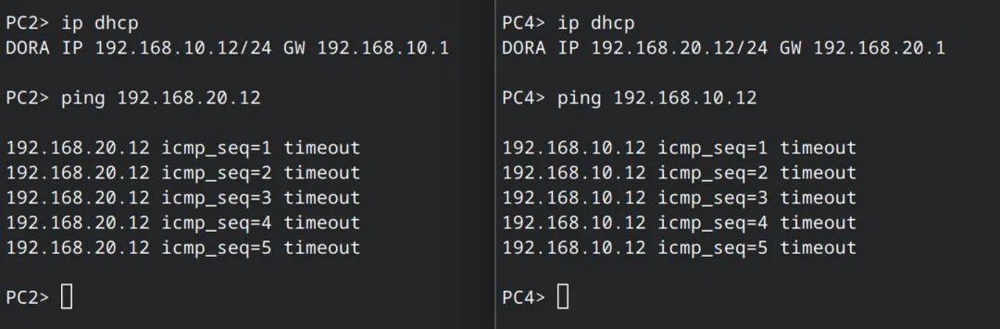

---

## Negociación IKEv2

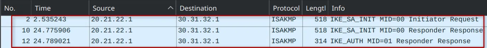

---

## Tráfico cifrado con ESP

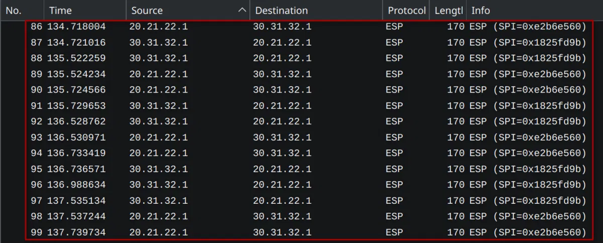

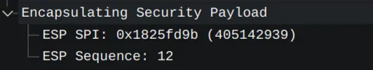

---

## Conectividad establecida

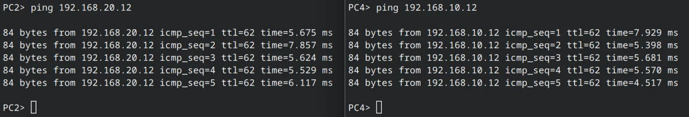

---

## Verificación del tunnel

### show crypto ikev2 sa

**R-SITE-A:**

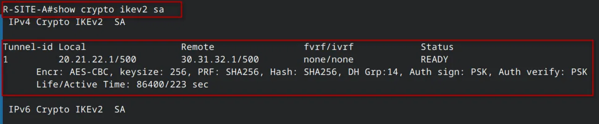

**R-SITE-B:**

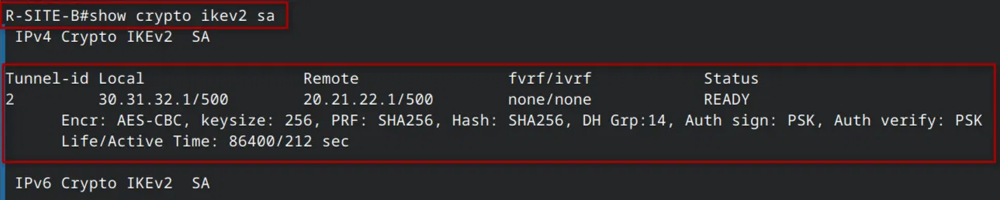

---

### show crypto ipsec sa

Interface: Tunnel0. Selectores: 0.0.0.0/0 (universales). Tag: Tunnel0-head-0 (autogenerado).

**R-SITE-A:**

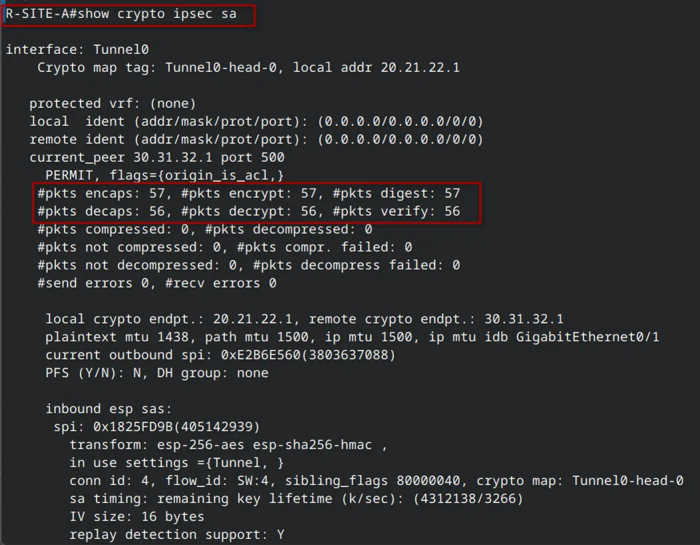

**R-SITE-B:**

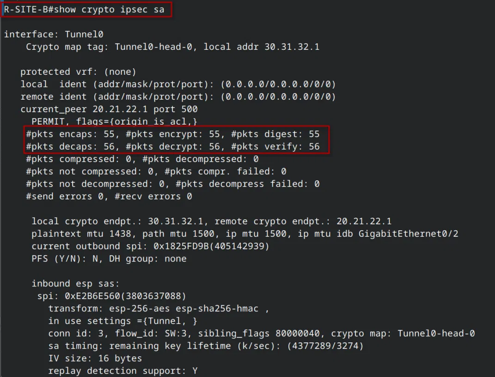

|Contador|R-SITE-A|R-SITE-B|
|:--|:-:|:-:|
|encaps / encrypt / digest|57 / 57 / 57|55 / 55 / 55|
|decaps / decrypt / verify|56 / 56 / 56|56 / 56 / 56|
|Outbound SPI|0xE2B6E560|0x1825FD9B|
|Inbound SPI|0x1825FD9B|0xE2B6E560|

---

### show ip ospf neighbor

Adyacencia FULL sobre Tunnel0. Multicast soportado nativamente por la VTI sin necesidad de GRE.

**R-SITE-A:**

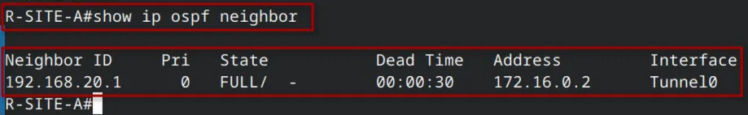

**R-SITE-B:**

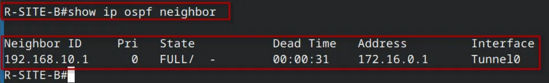

---

## Comparativa completa: los 6 métodos

|Método|IKE|Msgs|Tunnel|OSPF|Selección tráfico|
|:--|:--|:-:|:--|:-:|:--|
|PB IKEv1|v1|9|No|No|ACL subredes|
|RB IKEv1|v1|9|VTI|Sí|Rutas|
|GRE/IPSec|v1|9|GRE|Sí|ACL proto GRE|
|PB IKEv2|v2|4|No|No|ACL subredes|
|**RB IKEv2**|**v2**|**4**|**VTI**|**Sí**|**Rutas**|

---

## Video demostrativo

**LINK:** [https://youtu.be/wxOIFNp9TBE](https://youtu.be/wxOIFNp9TBE)

---

_Randy Nin / Matrícula 2025-0660_

---
